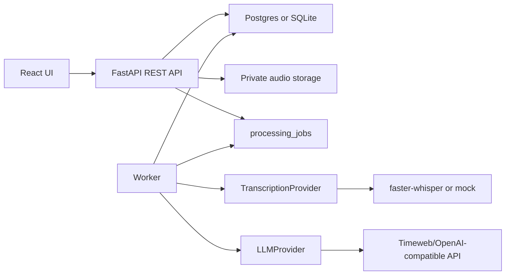
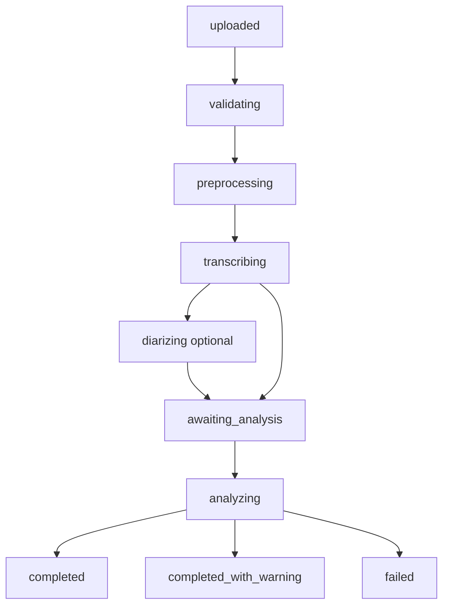
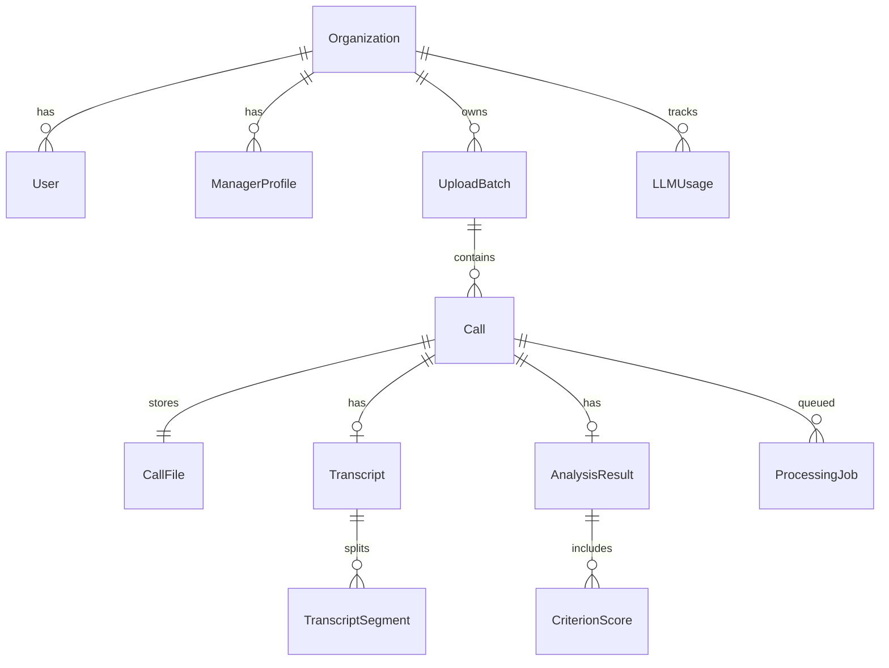

# Архитектура

```mermaid
flowchart LR
  Web["React UI"] --> API["FastAPI REST API"]
  API --> DB["Postgres or SQLite"]
  API --> Storage["Private audio storage"]
  API --> Jobs["processing_jobs"]
  Worker["Worker"] --> Jobs
  Worker --> Transcription["TranscriptionProvider"]
  Transcription --> Whisper["faster-whisper or mock"]
  Worker --> LLM["LLMProvider"]
  LLM --> Timeweb["Timeweb/OpenAI-compatible API"]
  Worker --> DB
```

```mermaid
flowchart TD
  Uploaded["uploaded"] --> Validating["validating"]
  Validating --> Preprocessing["preprocessing"]
  Preprocessing --> Transcribing["transcribing"]
  Transcribing --> Diarizing["diarizing optional"]
  Diarizing --> Awaiting["awaiting_analysis"]
  Transcribing --> Awaiting
  Awaiting --> Analyzing["analyzing"]
  Analyzing --> Completed["completed"]
  Analyzing --> Warning["completed_with_warning"]
  Analyzing --> Failed["failed"]
```

```mermaid
erDiagram
  Organization ||--o{ User : has
  Organization ||--o{ ManagerProfile : has
  Organization ||--o{ UploadBatch : owns
  UploadBatch ||--o{ Call : contains
  Call ||--|| CallFile : stores
  Call ||--o| Transcript : has
  Transcript ||--o{ TranscriptSegment : splits
  Call ||--o| AnalysisResult : has
  AnalysisResult ||--o{ CriterionScore : includes
  Call ||--o{ ProcessingJob : queued
  Organization ||--o{ LLMUsage : tracks
```
